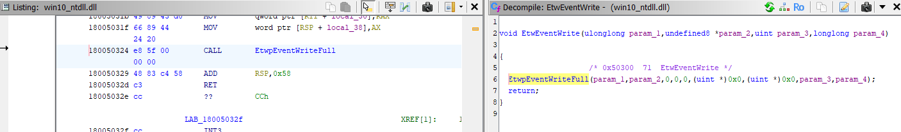
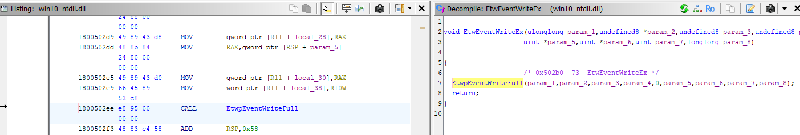
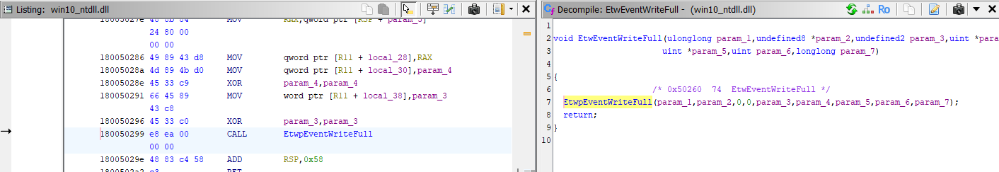
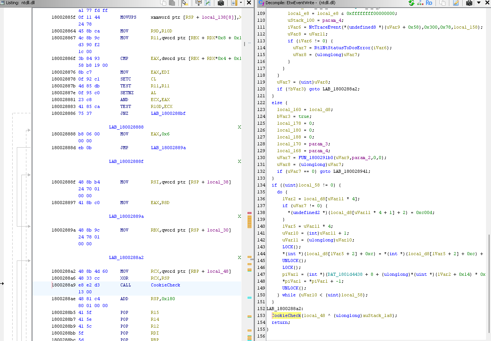
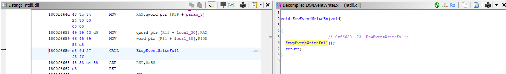
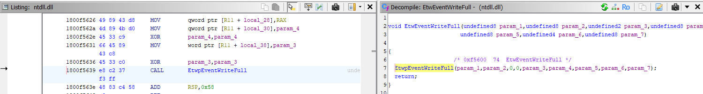

This project consists of several techniques or methods for patching ETW (Event Tracing for Windows) in Windows.

Just a heads-up: the function names can be a bit confusing, as they’re all almost identical... Just one of those Windows API things.

One day, I discovered that one of the patches I usually used stopped working on Windows 11 24H2, so I started digging to figure out what was going on. It turns out that ntdll.dll had undergone some changes introduced in version 24H2. These changes mainly affected the internal workings of the "EtwEventWrite" function in the context of ETW patching—it no longer called the private function "EtwpEventWriteFull". On the other hand, traditional patches on "EtwEventWriteFull" and "EtwEventWriteEx", which internally call "EtwpEventWriteFull", remain unaffected.

To clarify, the patches applied at the start of the functions "EtwEventWriteFull", "EtwEventWriteEx", and "EtwEventWrite" (the most common and widely used out there) are not affected, as they only modify the first few instructions of these functions, directly altering their execution flow.

Below, I’ve included images showing how the functions look in Windows 10 and in Windows 11 24H2 and later.

